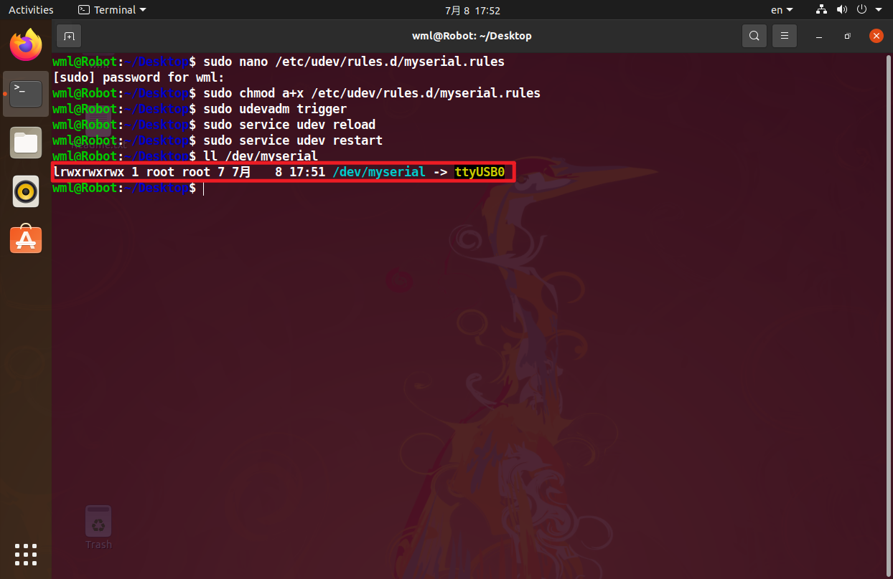

[TOC]

# 绑定设备ID

## 说明

在按照我们的Python基础控制教程和ROS基础教程操作时，我们需要将我们的ROS控制板设备ID绑定为指定端口号（也称设备重映射），如果没有绑定成指定端口号，在运行启动文件很有可能会产生报错。例如：

AttributeError：‘Rosmaster’ object has no attribute 'ser'

AttributeError：‘yahboomcar_driver’ object has no attribute 'velPublisher'

······（我们大部分ROS功能包都需要绑定成指定的端口号，操作步骤基本相同）

## 虚拟机

使用VMware Workstation进行设备ID绑定演示，其它主板（树莓派、Jetson系列等）进行设备ID绑定均可按照这个步骤操作。

### 1、打开虚拟机镜像


### 2、连接设备

将设备通过USB接口插入电脑，以下有两种方法进行设备的连接

#### 方法一

选择连接到虚拟机


#### 方法二（推荐）

在 ”虚拟机设置“ → "可移动设备" 选择对应设备连接


**注意：多个设备连接到虚拟机的步骤也是一样！**

## ROS控制板

### 查看系统所连接设备

```
lsusb
```


通过lsusb可以看到ROS控制板对应的USB设备信息（我们主要关注的设备ID信息是1a86:7523）

```
Bus 003 Device 006: ID 1a86:7523 QinHeng Electronics HL-340 USB-Serial adapter
```

#### 方法一

编辑myserial.rules文件

```
sudo nano /etc/udev/rules.d/myserial.rules
```

此处需要ROS控制板设备ID信息1a86:7523，以下是myserial.rules文件内容

```
KERNEL=="ttyUSB*", ATTRS{idVendor}=="1a86", ATTRS{idProduct}=="7523", MODE:="0777", SYMLINK+="myserial"
```

注意：这个步骤经常会有人出现绑定失败，建议直接打开我们提供的.md文件复制，不要直接复制pdf文件的内容，有可能出现绑定不成功现象。


注意：我习惯使用nano编辑器，你们可以根据自己习惯选择对应的编辑器进行文件新建和编辑

保存文件并退出，然后输入以下命令，给myserial.rules执行权限

```
sudo chmod a+x /etc/udev/rules.d/myserial.rules
```

输入以下三句命令，重新拔插ROS控制板设备

```
sudo udevadm trigger
sudo service udev reload
sudo service udev restart
```

输入以下命令，检查是否成功绑定设备号

```
ll /dev/myserial
```

出现下图所示图片，即可认为成功绑定了



注意：这里只要是ttyUSB开头的即可，多个设备相同的USB芯片，该节内容不演示。

#### 方法二（推荐）

首先下载编辑好的规则文件，然后在myserial.rules文件所在目录下打开终端


输入以下命令，复制编辑好的规则文件到/etc/udev/rules.d目录下

```
sudo cp myserial.rules /etc/udev/rules.d/
cd /etc/udev/rules.d/
ls
```

然后输入以下命令，给myserial.rules执行权限

```
sudo chmod a+x /etc/udev/rules.d/myserial.rules
```

输入以下三句命令，重新拔插ROS控制板设备

```
sudo udevadm trigger
sudo service udev reload
sudo service udev restart
```

输入以下命令，检查是否成功绑定设备号

```
ll /dev/myserial
```

出现下图所示图片，即可认为成功绑定了


注意：这里只要是ttyUSB开头的即可，多个设备相同的USB芯片，该节内容不演示。
