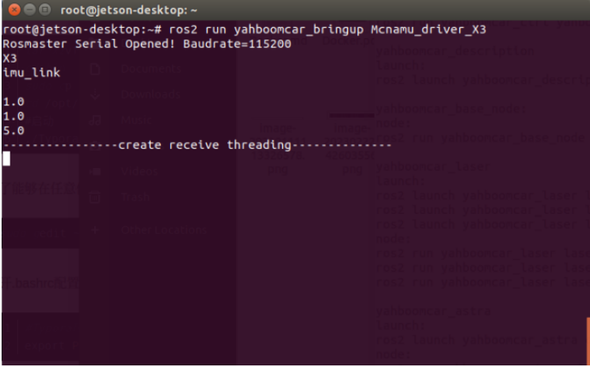
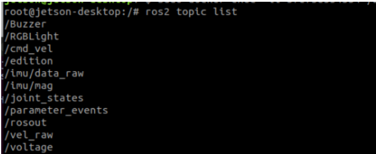
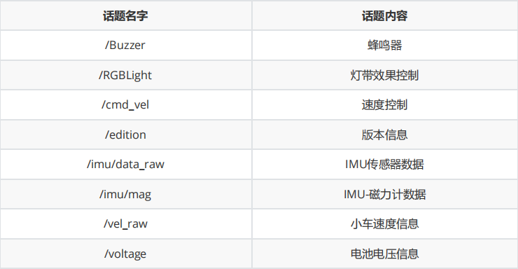
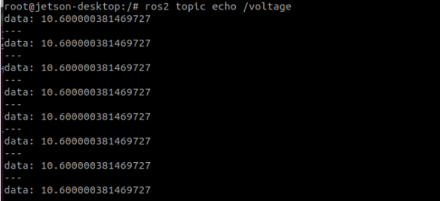
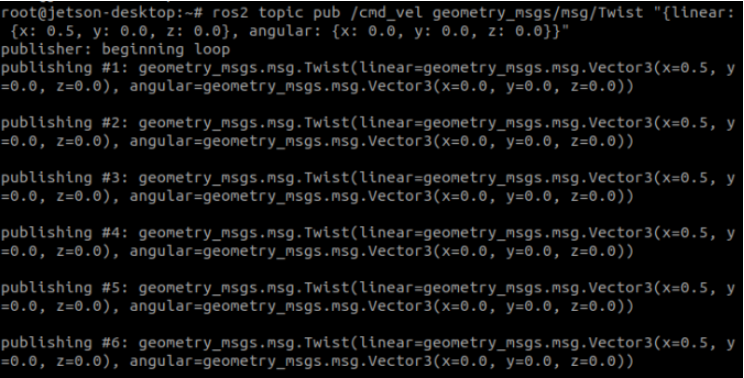

### 2、机器人信息发布

程序运行后，ros拓展板会实时返回数据，包括电压，IMU数据，连接小车编码器还可以获取小车的速度。

### 1、启动

以本公司Rosmaster-X3为例，终端输入以下命令启动，

```
ros2 run yahboomcar_bringup Mcnamu_driver_X3
```



### 2、查看话题节点

终端输入，

```
ros2 topic list
```





### 3、读取话题数据

以读取电压大小，终端输入，

```
ros2 topic echo /voltage
```



### 4、发布话题数据

以发布/cmd_vel速度数据为例，终端输入，

```
ros2 topic pub /cmd_vel geometry_msgs/msg/Twist "{linear: {x: 0.5, y: 0.0, z:0.0}, angular: {x: 0.0, y: 0.0, z: 0.2}}"
```



### 5、源码解析

```python
from Rosmaster_Lib import Rosmaster #导入驱动库
self.car = Rosmaster() #实例化Rosmaster对象
#create subcriber 创建订阅者
self.sub_cmd_vel =
self.create_subscription(Twist,"cmd_vel",self.cmd_vel_callback,1)
self.sub_RGBLight =
self.create_subscription(Int32,"RGBLight",self.RGBLightcallback,100)
self.sub_BUzzer =
self.create_subscription(Bool,"Buzzer",self.Buzzercallback,100)
#create publisher 创建发布者
self.EdiPublisher = self.create_publisher(Float32,"edition",100)
self.volPublisher = self.create_publisher(Float32,"voltage",100)
self.staPublisher = self.create_publisher(JointState,"joint_states",100)
self.velPublisher = self.create_publisher(Twist,"vel_raw",50)
self.imuPublisher = self.create_publisher(Imu,"/imu/data_raw",100)
self.magPublisher = self.create_publisher(MagneticField,"/imu/mag",100)
#调用库，读取ros拓展板的信息
edition.data = self.car.get_version()*1.0
battery.data = self.car.get_battery_voltage()*1.0
ax, ay, az = self.car.get_accelerometer_data()
gx, gy, gz = self.car.get_gyroscope_data()
mx, my, mz = self.car.get_magnetometer_data()
vx, vy, angular = self.car.get_motion_data()
#发布话题数据
self.imuPublisher.publish(imu)
self.magPublisher.publish(mag)
self.volPublisher.publish(battery)
self.EdiPublisher.publish(edition)
self.velPublisher.publish(twist)
#订阅者回调函数
def cmd_vel_callback(self,msg)
def RGBLightcallback(self,msg)
def Buzzercallback(self,msg):
```

详细代码请参考代码：~/driver_ws/src/yahboomcar_bringup/yahboomcar_bringup/Mcnamu_driver_X3.py