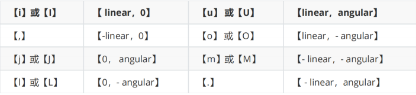
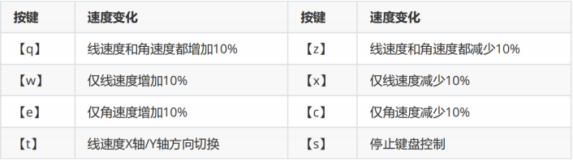
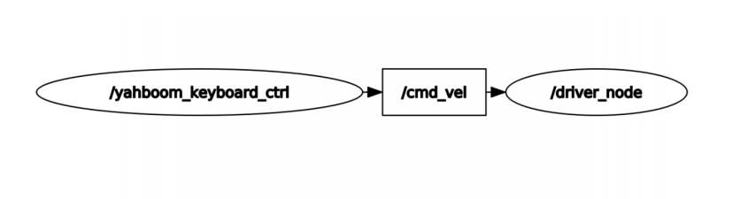

## 3、机器人键盘控制

### 1、程序启动

成功安装好Rosmaster库以及编译工作空间通过后，我们可以输入以下指令来启动小车键盘控制，以本公司Rosmaster-X3麦克纳姆轮子为例，终端输入，

```python
#底层驱动
ros2 run yahboomcar_bringup Mcnamu_driver_X3
#键盘控制
ros2 run yahboomcar_ctrl yahboom_keyboard
```

### 2、按键说明

方向控制



速度控制



### 3、节点通讯图

输入以下指令查看节点通讯图，

```
ros2 run rqt_graph rqt_graph
```



### 4、源码解析

键盘控制只能控制小车的运动控制，因此，只有一个/cmd_vel速度发布者，

```
self.pub = self.create_publisher(Twist,'cmd_vel',1)
```

程序还定义了两个字典来检测键盘的字母按下时候的变化，

```python
moveBindings = {
'i': (1, 0),
'o': (1, -1),
'j': (0, 1),
'l': (0, -1),
'u': (1, 1),
',': (-1, 0),
'.': (-1, 1),
'm': (-1, -1),
'I': (1, 0),
'O': (1, -1),
'J': (0, 1),
'L': (0, -1),
'U': (1, 1),
'M': (-1, -1),
}

speedBindings = {
'Q': (1.1, 1.1),
'Z': (.9, .9),
'W': (1.1, 1),
'X': (.9, 1),
'E': (1, 1.1),
'C': (1, .9),
'q': (1.1, 1.1),
'z': (.9, .9),
'w': (1.1, 1),
'x': (.9, 1),
'e': (1, 1.1),
'c': (1, .9),
} 
```

进入while循环，程序会读取键盘按下的值，然后进行一层一层的判断，

```
key = yahboom_keyboard.getKey()
if key=="t" or key == "T": xspeed_switch = not xspeed_switch
elif key == "s" or key == "S":
...
if key in moveBindings.keys():
...
elif key in speedBindings.keys():
..
```

最后，根据多层的判断，赋值给twist.linear.x、twist.linear.y、twist.angular.z然后发布出去。

```
if xspeed_switch: twist.linear.x = speed * x
else: twist.linear.y = speed * x
twist.angular.z = turn * th
if not stop: yahboom_keyboard.pub.publish(twist)
if stop:yahboom_keyboard.pub.publish(Twist())
```

详细代码参考：~/driver_ws/src/yahboomcar_ctrl/yahboomcar_ctrl/yahboom_keyboard.py。