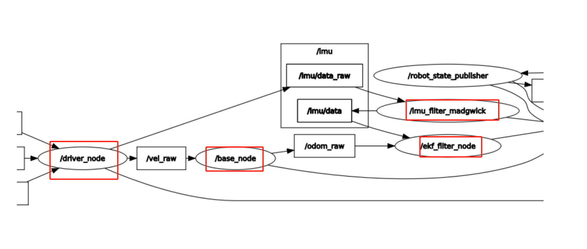

## 4、机器人状态估计

通过ROS拓展板上的IMU模块加上轮子的编码器，可以估计当前小车的位置和姿态，这个在建图导航中有着重要的作用。

### 1、启动

以本公司的Rosmaster-X3为例，终端输入命令，

```
ros2 launch yahboomcar_bringup yahboomcar_bringup_X3_launch.py
```

#### 2、查看节点通讯图

```
ros2 run rqt_graph rqt_graph
```



主要是看以上图红色框的节点输入输出，可以看的出来，/ekf_filter_node接收odom_raw数据和imu_data数据进行融合，最后输出发布一个odom数据，我们可以通过ros2 node 工具来查看，终端输入，

```
ros2 node info /ekf_filter_node
```

### 3、launch文件解析

我们看下launch文件主要的相关节点，

- /driver_node：启动小车底盘，获取到轮子的速度vel数据，发布给/base_node节点，获取imu数据，发布给/Imu_filter_madgwick节点;
- /base_node：接收vel数据，通过计算，转换成odom_raw数据，发布给/ekf_filter_node节点；
- /Imu_filter_madgwick：接收底盘发布的imu数据，通过自身算法过滤后，发布过滤后的imu/data数据给/ekf_filter_node节点;
- /ekf_filter_node：接收/base_node节点发布的odom数据和/Imu_filter_madgwick发布过来的imu/data数据，通过自身算法，融合后，发布odom数据。