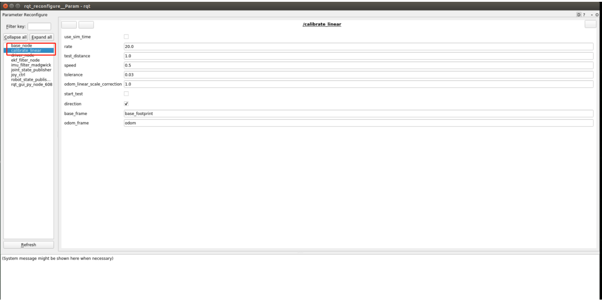
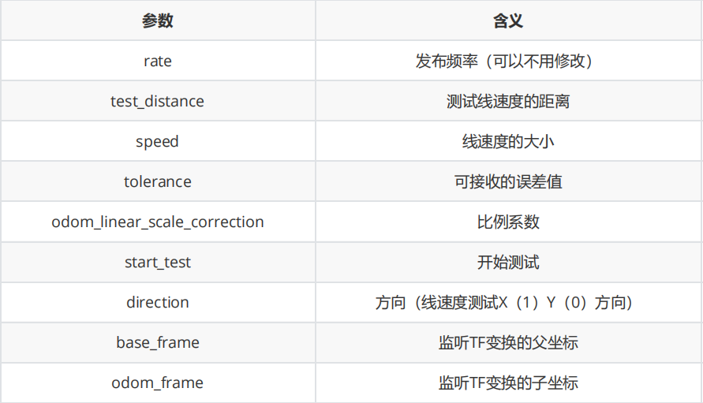

## 5、机器人校准

启动程序后，结合小车上的编码器，通过调节参数，我们可以对小车的线速度和角速度进行校准。

### 1、启动

以本公司产品Rosmaster-X3为例，终端输入以下命令启动，

```shell
#底盘驱动
ros2 launch yahboomcar_bringup yahboomcar_bringup_X3_launch.py
#标定线速度
ros2 run yahboomcar_bringup calibrate_linear_X3
#标定角速度
ros2 run yahboomcar_bringup calibrate_angular_X3
#动态参数调节
ros2 run rqt_reconfigure rqt_reconfigure
```



以标定线速度为例，点击“start_test”小车标定x方向的线速度，观察小车是否移动了test_distance距离，这里默认设置是1m，标定前可以自定义测试的距离，必须是小数，设置完点击空白处，程序会自动写入。如果小车移动的距离超过可接收误差的范围（tolerance变量的值），那么就设置odom_linear_scale_correction的值。以下是各个参数的含义，



测试角速度的变量设置大致上一致，不过是test_distance变成了test_angle测试角度并且speed变成了角速度大小了。

### 2、程序核心源码解析

这个程序主要是运用了TF监听坐标间的变换来实现的，通过监听base_footprint与odom之间的坐标变换来让机器人知道“我现在走了多远/我现在转了多少度”。

```python
#监听TF变换
def get_position(self):
	try:
		now = rclpy.time.Time()
		trans = self.tf_buffer.lookup_transform(self.odom_frame,self.base_frame,now)
	return trans
	except (LookupException, ConnectivityException, ExtrapolationException):
	self.get_logger().info('transform not ready')
	raise
	return
#获取当前的xy坐标，根据之前的xy坐标，计算距离
self.position.x = self.get_position().transform.translation.x
self.position.y = self.get_position().transform.translation.y
print("self.position.x: ",self.position.x)
print("self.position.y: ",self.position.y)
distance = sqrt(pow((self.position.x - self.x_start), 2) +
	pow((self.position.y - self.y_start), 2))
distance *= self.odom_linear_scale_correction
```

calibrate_angular_X3核心代码如下，

```python
#这里同样是监听了TF变换，获取到了当前位姿信息，只不过这里还做了转换，把四元数转了欧拉角的转换，
然后再返回
def get_odom_angle(self):
	try:
		now = rclpy.time.Time()
		rot = self.tf_buffer.lookup_transform(self.odom_frame,self.base_frame,now)
		#print("oring_rot: ",rot.transform.rotation)
		cacl_rot = PyKDL.Rotation.Quaternion(rot.transform.rotation.x,
		rot.transform.rotation.y, rot.transform.rotation.z, rot.transform.rotation.w)
		#print("cacl_rot: ",cacl_rot)
		angle_rot = cacl_rot.GetRPY()[2]
		#print("angle_rot: ",angle_rot)
	except (LookupException, ConnectivityException, ExtrapolationException):
	self.get_logger().info('transform not ready')
	return
#计算旋转角度
self.odom_angle = self.get_odom_angle()
self.delta_angle = self.odom_angular_scale_correction *
self.normalize_angle(self.odom_angle - self.first_angle)
```

发布的TF变换是在base_node该节点发布的，代码路径是，

```
~/driver_ws/src/yahboomcar_base_node/src/base_node_X3
```

该节点会接收/vel_raw的数据，通过数学计算，发布odom数据，同时发布了TF变换，核心代码如下，

```c++
//计算xy坐标以及xyzw四元数的值，xy两点坐标表示位置，xyzw四元数表示姿态
double delta_heading = angular_velocity_z_ * vel_dt_; //radians
double delta_x = (linear_velocity_x_ * cos(heading_)-
linear_velocity_y_*sin(heading_)) * vel_dt_; //m
double delta_y = (linear_velocity_x_ *
sin(heading_)+linear_velocity_y_*cos(heading_)) * vel_dt_; //m
x_pos_ += delta_x;
y_pos_ += delta_y;
heading_ += delta_heading;
tf2::Quaternion myQuaternion;
geometry_msgs::msg::Quaternion odom_quat ;
myQuaternion.setRPY(0.00,0.00,heading_ );
#发布TF变换
geometry_msgs::msg::TransformStamped t;
rclcpp::Time now = this->get_clock()->now();
t.header.stamp = now;
t.header.frame_id = "odom";
t.child_frame_id = "base_footprint";
t.transform.translation.x = x_pos_;
t.transform.translation.y = y_pos_;
t.transform.translation.z = 0.0;
t.transform.rotation.x = myQuaternion.x();
t.transform.rotation.y = myQuaternion.y();
t.transform.rotation.z = myQuaternion.z();
t.transform.rotation.w = myQuaternion.w();
tf_broadcaster_->sendTransform(t);
```

