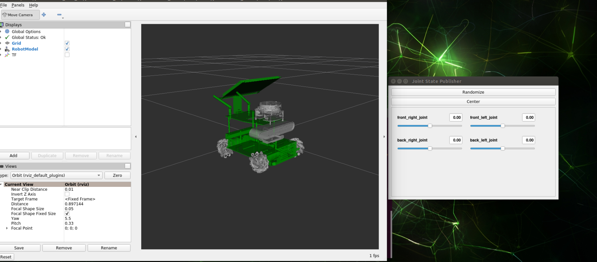
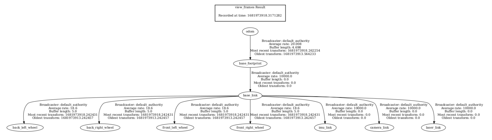

## 6、URDF模型

### 1、程序启动

成功安装好Rosmaster库以及编译工作空间通过后，我们可以输入以下指令来启动rviz显示URDF模型，以本公司Rosmaster-X3麦克纳姆轮子为例，终端输入，

```
ros2 launch yahboomcar_descriptio display_X3.launch.py
```



### 2、查看TF树

终端输入，

```
ros2 run tf2_tools view_frames.py
```

会在终端目录下生成一个frame.pdf文件，然后我们以下命令打开查看，

```
evince frames.pdf
```



### 3、URDF简介

URDF，全称为 Unified Robot Description Format ，翻译为中文为 统一机器人描述性格式，是一种使

用xml格式描述的机器人模型文件，类似于D-H参数。

```xml
<?xml version="1.0" encoding="utf-8"?>
<robot name="yahboomcar">
</robot>
```

第一行为xml必填项，描述了xml的版本信息。

第二行描述了当前的机器人名称；当前机器人所有信息均包含在【robot】标签内。

#### 3.1、组成部分

- link，连杆，可以想象成是人的手臂
- joint，关节，可以想象成是人的手肘关节

link与joint的关系：两个link之间通过关节连接起来，想象成手臂有小臂(link)和大臂(link)通过肘关节(joint)连接。

##### 3.1.1、link

1）、简介

在URDF描述性语言中，link是用来描述物理特性的，

- 描述视觉显示， <visual> 标签。
- 描述碰撞属性， <collision> 标签。
- 描述物理惯性， <inertial> 标签不常用。

Links还可以描述连杆尺寸(size)\颜色(color)\形状(shape)\惯性矩阵(inertial matrix)\碰撞参数(collision

properties)等，每个Link会成为一个坐标系。

2）、示例代码（yahboomcar_X3.urdf）

```xml
<link name="base_link">
        <inertial>
            <origin xyz="0.00498197982182523 5.70233829969297E-05 -0.0121008098068578" rpy="0 0 0"/>
            <mass value="0.486218814966626"/>
            <inertia
                    ixx="0.00196277727666921"
                    ixy="2.50447049446755E-07"
                    ixz="0.000140534767811098"
                    iyy="0.00457256033711368"
                    iyz="2.68618064993882E-07"
                    izz="0.00493927269870476"/>
        </inertial>
        <visual>
            <origin xyz="0 0 0" rpy="0 0 0"/>
            <geometry>
                <mesh filename="package://yahboomcar_description/meshes/base_link_X3.STL"/>
            </geometry>
            <material name="">
                <color rgba="0 0.7 0 1"/>
            </material>
        </visual>
        <collision>
            <origin xyz="0 0 0" rpy="0 0 0"/>
            <geometry>
                <mesh filename="package://yahboomcar_description/meshes/base_link_X3.STL"/>
            </geometry>
        </collision>
    </link>
```

3）标签介绍

- origin

  描述的是位姿信息； xyz 属性描述的是在大环境中的坐标位置， rpy 属性描述的是自身的姿态。

- mess

  描述的是link的质量。

- inertia

  惯性参考系，由于转动惯性矩阵的对称性，只需要6个上三角元素 ixx, ixy, ixz, iyy, iyz, izz作为属

  性。

- geometry

  标签描述的是形状； mesh 属性主要的功能是去加载纹理文件的， filename 属性纹理路径的文件

  地址。

  ```xml
  <box size="1 2 3"/> #box箱体，通过size属性描述盒装的长宽高。
  <cylinder length="1.6" radius="0.5"/> #cylinder圆柱状，通过`length`属性描述圆
  柱的高度，`radius`属性描述圆柱的的半径。
  <sphere radius="1"/> #sphere球状，通过`radius`属性描述球的半径。
  ```

- material

  标签描述的是材质； name 属性为**必填项**，可以为空，可以重复 。通过【color】标签中的 rgba 属

  性来描述红、绿、蓝、透明度，中间用空格分隔。颜色的范围为[0-1]。

#### 3.1.2、joints

1）、简介

描述两个关节之间的关系，运动位置和速度限制，运动学和动力学属性。

关节类型：

- fixed：固定关节。不允许运动，起连接作用。
- continuous：旋转关节。可以持续旋转，没有旋转角度的限制。
- revolute：旋转关节。类似于continuous，有旋转角度的限制。
- prismatic：滑动关节。沿某一轴线移动，有位置限制。
- floating：悬浮关节。具备六个自由度，3T3R。
- planar：平面关节。允许在平面正交上方平移或者旋转。

2）、示例代码（yahboomcar_X3.urdf）

```xml
<joint name="front_right_joint" type="continuous">
	<origin xyz="0.08 -0.0845 -0.0389" rpy="-1.5703 0 3.14159"/>
	<parent link="base_link"/>
	<child link="front_right_wheel"/>
	<axis xyz="0 0 1" rpy="0 0 0"/>
	<limit effort="100" velocity="1"/>
</joint>
```

在【joint】标签中 name 属性是 **必填项**，描述关节的名称,并且是唯一。

在【joint】标签中 type 属性，对应填写六大关节类型。

3）、标签介绍

- origin

  子标签,指的是旋转关节于 parent 所在坐标系的相对位置。

- parent，child

  parent，child子标签代表的是两个要连接的link；parent是参照物，child围绕着praent旋转。

- axis

  子标签表示child对应的link围绕哪一个轴（xyz）旋转和述绕固定轴的旋转量。

- limit

  子标签主要是限制child的。 lower 属性和 upper 属性限制了旋转的弧度范围， effort 属性限制的

  是转动过程中的受力范围。(正负value值，单位为牛或N)， velocity 属性限制了转动时的速度，

  单位为米/秒或m/s。

- mimic

  描述该关节与已有关节的关系。

- safety_controller

  描述安全控制器参数。保护机器人关节的运动。

